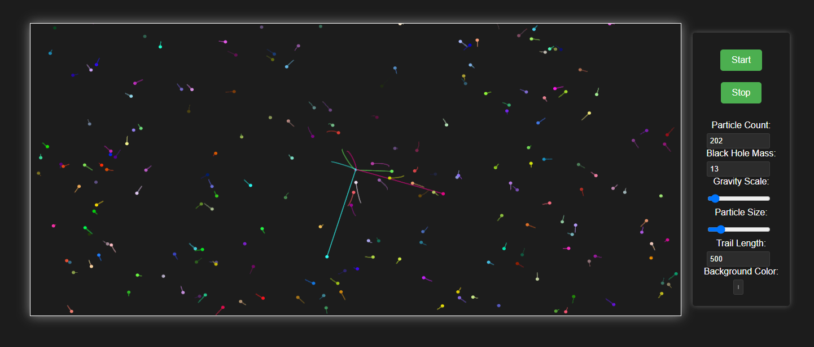

# Black Hole Particle Simulation (BHPS)

BHPS aims to simulate a particle system interacting with a central black hole using Python

## Inspo

This repository is a fork inspired by [JoeSzeles/Black-Hole--Planetary-System-Simulator--QI:main](https://github.com/JoeSzeles/Black-Hole--Planetary-System-Simulator--QI)

The inspiration behind this particle simulation with a black hole comes from exploring the dynamics of gravitational interactions in a simulated environment.

Drawing on concepts from physics and astronomy, this project aims to visualize how particles behave under the influence of a massive central object, akin to a black hole

## Features

- Real-time rendering of the particle simulation on a canvas element
- Interactive controls to start, stop, and adjust the simulation parameters:
  - Particle count
  - Black hole mass
  - Gravity scale

 

## Acknowledgments

- Original inspiration and initial code base from [JoeSzeles/Black-Hole--Planetary-System-Simulator--QI:main](https://github.com/JoeSzeles/Black-Hole--Planetary-System-Simulator--QI)

